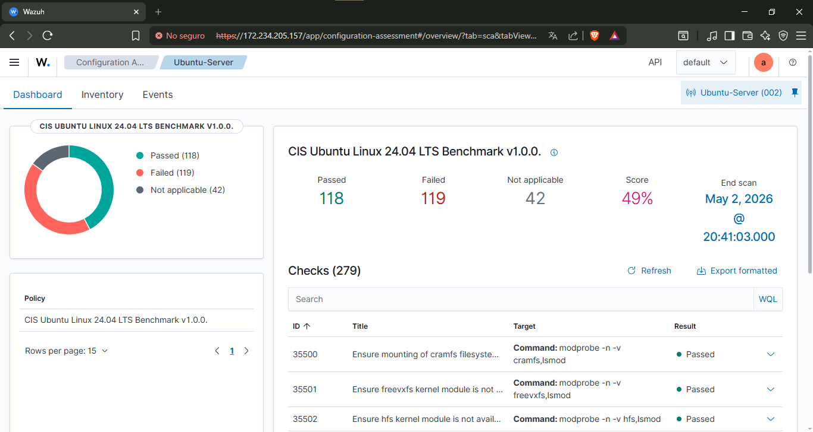
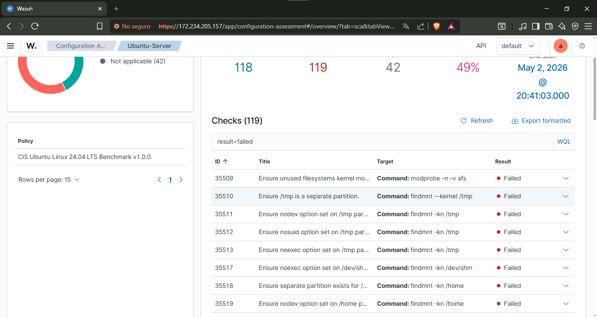
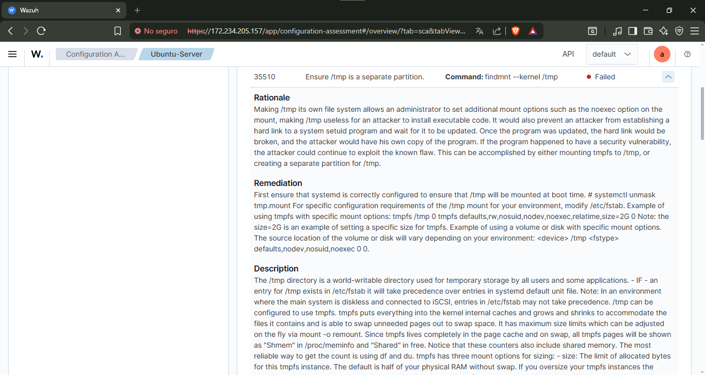
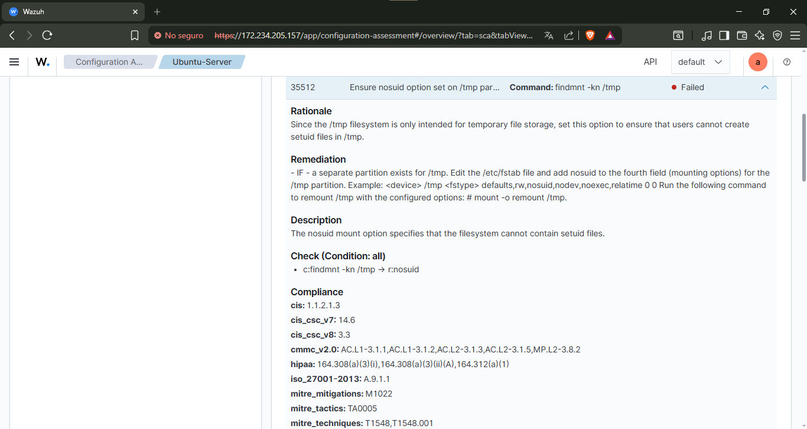
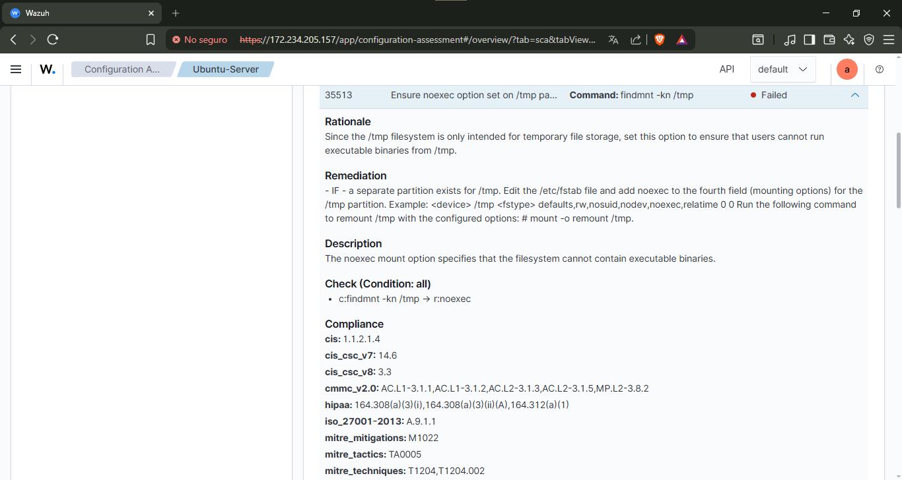
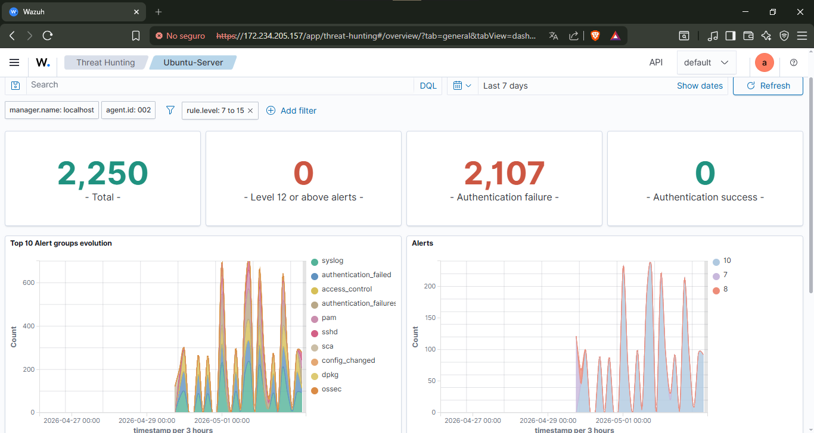
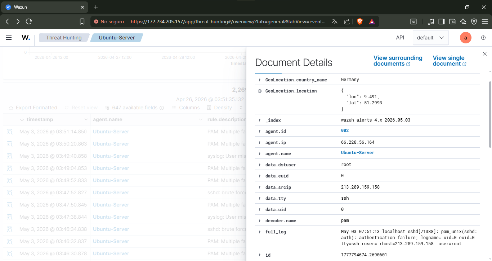
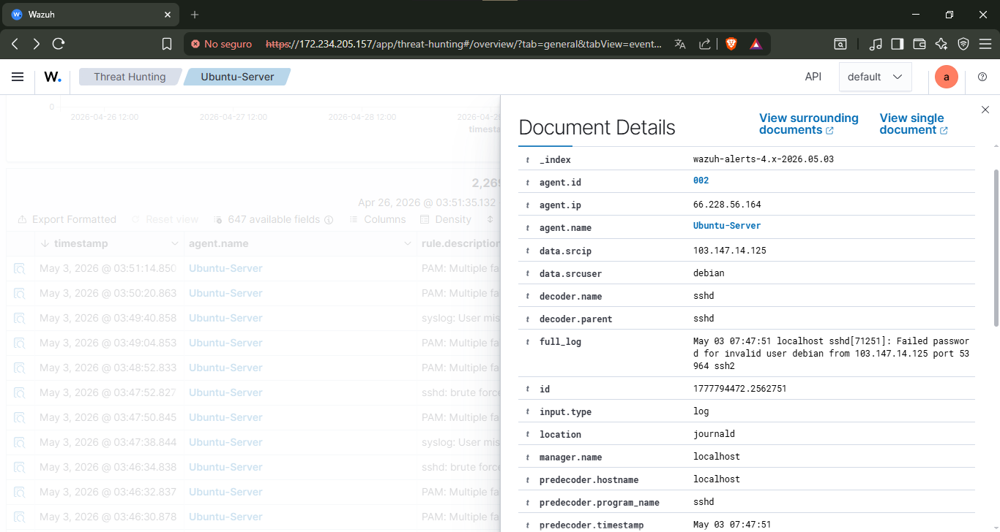
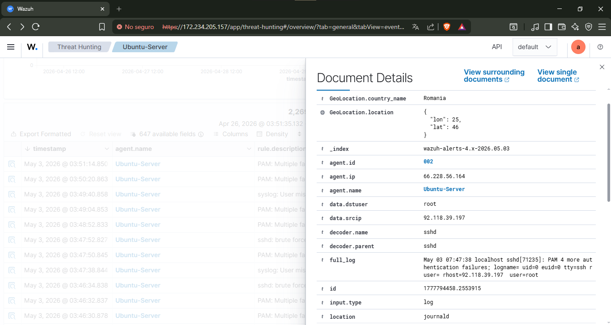

### Perfil utilizado analista8
guarda estas rutas pal principio del informe y en el orden que están

## II. Análisis de Causa Raíz (RCA) - Técnica de los "5 Porqués"

**Incidente seleccionado (Threat Hunting):**

Intentos de ataques masivos contra el servicio SSH (2.107 alertas registradas)

**Falla de configuración asociada (Configuration Assessment):**

Directorio _/tmp_ sin particionamiento aislado ni restricciones de ejecución (_noexec_, _nosuid_), evaluado con fallos en las Reglas SCA 35510, 35512 y 35513.

1. **¿Por qué el atacante logró ejecutar esta acción masiva en el servidor?**
   Porque el atacante (IP origen: 213.209.159.158, Alemania. IP origen: 92.118.39.197, Romania. Otros botnets sin dirección IP) pudo enviar miles de solicitudes de autenticación ininterrumpidas dirigidas al usuario __root__ sin ser bloqueado.

2. **¿Por qué el sistema operativo presentaba esa vulnerabilidad o exposición?**
   Porque el puerto 22 (SSH) estaba expuesto directamente a Internet, permitiendo intentos de inicio de sesión por contraseña para el superusuario (__root__), sin un mecanismo de mitigación como Fail2Ban.

3. **¿Por qué el servidor estaba configurado de esa manera insegura?**
   Porque el sistema Ubuntu se desplegó con las configuraciones por defecto. Esto no solo expuso el SSH, sino que dejó directorios temporales sin restricciones. Si el ataque SSH hubiese tenido éxito, el atacante habría podido alojar y ejecutar código malicioso libremente en la carpeta _/tmp_ debido a la falta del parámetro _noexec_ (Regla 35513).

4. **¿Por qué el equipo de TI no implementó dicho control antes de exponer el servidor a Internet?**
   Porque no se ejecutó una evaluación de configuración de seguridad (SCA) ni se aplicó un estándar de Hardening (como CIS Benchmarks) previo a la salida a producción, dejando al servidor con un nivel de cumplimiento de apenas un 49%.

5. **¿Por qué se permitió que el equipo operara con esos procesos deficientes?**
   Porque la gerencia de la empresa carece de una política formal de paso a producción y validación de DevSecOps, permitiendo el despliegue de infraestructura crítica sin auditoría previa.

## III. Evaluación Cuantitativa y Matriz de Riesgo

**Tabla de Incidentes (Threat Hunting):**

| ID Alerta | Descripción del Hallazgo (Wazuh) | Probabilidad (1-5) | Impacto (1-5) | Riesgo (P x I) | Zona de Calor |
| :--- | :--- | :--- | :--- | :--- | :--- |
| **5551** | PAM: Multiple failed logins in a small period of time. | 5 | 4 | 20 | Inaceptable |
| **5712** | sshd: brute force trying to get access to the system. Non existent user. | 5 | 3 | 15 | Inaceptable |
| **2502** | syslog: User missed the password more than one time. | 5 | 2 | 10 | Significativo |

*Nota de justificación:*Se asigna una __probabilidad de 5__ a todas las alertas debido a que los registros de Wazuh evidencian que se trata de un ataque automatizado y constante (más de 2.000 eventos en un periodo corto). El impacto varía dependiendo de si apuntan al usuario _root_ (mayor impacto sistémico) o a usuarios inexistentes.

**Heatmap (Matriz 5x5):**
*(Zonas: Aceptable 1-3, Moderado 4-7, Significativo 8-14, Inaceptable 15-25)*

| Impacto \ Prob. | 1 | 2 | 3 | 4 | 5 |
| :---: | :---: | :---: | :---: | :---: | :---: |
| **5** | 5 | 10 | 15 | 20 | 25 |
| **4** | 4 | 8 | 12 | 16 | __20 (Regla 5551)__ |
| **3** | 3 | 6 | 9 | 12 | __15 (Regla 5712)__ |
| **2** | 2 | 4 | 6 | 8 | __10 (Regla 2502)__ |
| **1** | 1 | 2 | 3 | 4 | 5 |

## VI. Playbook de Respuesta Operativa (Anexo Detallado)

**Amenaza analizada:**

Intrusión por Fuerza Bruta SSH y Riesgo de Ejecución de Código en _/tmp_.

| Etapa del Playbook | Indicaciones Técnicas a Ejecutar |
| :--- | :--- |
| **1. Detección y Análisis** | - **Reglas Wazuh disparadas:** ID 5551, 5712, 2502 (Nivel 10). - **Vector:** `tty=ssh`, apuntando a `user=root`. - **Origen malicioso:** IP: 213.209.159.158 (Alemania), 92.118.39.197 (Romania). - **Escalamiento:** Notificar inmediatamente al CISO y Administrador de Red. |
| **2. Contención Inicial** | - **Corto Plazo:** Ingresar las IP mencionadas a la lista negra del Firewall perimetral y de AWS/Azure (Network Security Group). - **Corto Plazo:** Detener temporalmente el servicio `sshd` si los intentos persisten desde otras IPs. |
| **3. Erradicación** | - **Acción 1 (Identidad):** Modificar `/etc/ssh/sshd_config` para establecer `PermitRootLogin no` y `PasswordAuthentication no` (forzando uso de llaves RSA/Ed25519). - **Acción 2 (Hardening Sistema):** Modificar `/etc/fstab` para montar el directorio `/tmp` con las directivas `nodev`, `nosuid`, y `noexec` para mitigar las alertas SCA 35510, 35512 y 35513. Reiniciar el demonio `systemd`. |
| **4. Recuperación** | - **Validación:** Ejecutar un nuevo escaneo manual de "Configuration Assessment" en el agente 002 (Ubuntu-Server) para verificar que el Score suba del 49% actual y las reglas del `/tmp` marquen "Passed". - **Monitoreo:** Crear regla personalizada en Wazuh para notificar por email si se detectan más de 5 fallos SSH en 1 minuto. |
| **5. Lecciones Aprendidas** | - **Reflexión Estratégica:** Ningún servidor debe ser expuesto a WAN sin un checklist de seguridad previo. Se debe redactar una política de control de acceso que estipule la obligatoriedad de VPN o conexiones Zero Trust para la administración remota de infraestructura crítica. |