:::portada

# Caso de estudio
## Operación cadena Fría | Logística Austral Ltda.

__Marco Contreras__  
&nbsp;&nbsp;[marco.contreras11@inacapmail.cl](mailto:marco.contreras11@inacapmail.cl)

__Benjamín Caba__  
&nbsp;&nbsp;[benjamin.caba@inacapmail.cl](mailto:benjamin.caba@inacapmail.cl)

 

__Docente__: Marcos Nathanael Rodríguez Cerda
:::

<h2 align="center">Índice</h2>

:::toc
  - [Contexto del caso](#contexto-del-caso)
  - [Línea de tiempo del incidente "Operación Cadena Fría"](#línea-de-tiempo-del-incidente-operación-cadena-fría)
    - [Antecedentes adicionales](#antecedentes-adicionales)
  - [Preguntas](#preguntas)
    - [1. ¿El ingreso a los sistemas de Logística Austral fue ilegal?](#1-el-ingreso-a-los-sistemas-de-logística-austral-fue-ilegal)
    - [2. ¿Se configura como "acceso ilícito a un sistema informático" según la ley?](#2-se-configura-como-acceso-ilícito-a-un-sistema-informático-según-la-ley)
    - [3. ¿Puede imputarse penalmente la instalación del malware tipo keylogger y backdoor?](#3-puede-imputarse-penalmente-la-instalación-del-malware-tipo-keylogger-y-backdoor)
    - [4. ¿Qué artículo sanciona esta conducta?](#4-qué-artículo-sanciona-esta-conducta)
    - [5. ¿Existió sabotaje, daño, alteración o eliminación de datos?](#5-existió-sabotaje-daño-alteración-o-eliminación-de-datos)
    - [6. ¿Podría aplicarse la figura de “daño informático” aunque los datos solo hayan sido copiados?](#6-podría-aplicarse-la-figura-de-daño-informático-aunque-los-datos-solo-hayan-sido-copiados)
    - [7. ¿El correo exigiendo criptomonedas constituye “extorsión”?](#7-el-correo-exigiendo-criptomonedas-constituye-extorsión)
    - [8. ¿Qué fallos de seguridad permitieron el ataque?](#8-qué-fallos-de-seguridad-permitieron-el-ataque)
    - [9. ¿Existían políticas de control de acceso y cifrado de datos?](#9-existían-políticas-de-control-de-acceso-y-cifrado-de-datos)
    - [10. ¿Se cumplían los estándares mínimos de ciberseguridad exigidos por la ley?](#10-se-cumplían-los-estándares-mínimos-de-ciberseguridad-exigidos-por-la-ley)
    - [11. ¿La empresa realizaba auditorías de seguridad periódicas?](#11-la-empresa-realizaba-auditorías-de-seguridad-periódicas)
    - [12. ¿Existía un plan de respuesta ante incidentes?](#12-existía-un-plan-de-respuesta-ante-incidentes)
    - [13. ¿Cómo debería responder la empresa ante el incidente según la ley?](#13-cómo-debería-responder-la-empresa-ante-el-incidente-según-la-ley)
    - [14. ¿Qué acciones urgentes debe tomar para contener el daño?](#14-qué-acciones-urgentes-debe-tomar-para-contener-el-daño)
    - [15. ¿A qué autoridades debe notificar?](#15-a-qué-autoridades-debe-notificar)
    - [16. ¿Se vulneró el principio de confidencialidad y seguridad de los datos?](#16-se-vulneró-el-principio-de-confidencialidad-y-seguridad-de-los-datos)
    - [17. ¿Se protegieron los datos personales de acuerdo con la ley?](#17-se-protegieron-los-datos-personales-de-acuerdo-con-la-ley)
    - [18. ¿Qué responsabilidad tiene la empresa por la filtración?](#18-qué-responsabilidad-tiene-la-empresa-por-la-filtración)
    - [19. ¿Incumplió su deber de proteger los datos?](#19-incumplió-su-deber-de-proteger-los-datos)
    - [20. ¿Omitió notificar a los afectados y a la autoridad de control?](#20-omitió-notificar-a-los-afectados-y-a-la-autoridad-de-control)
    - [21. ¿Qué tipos de datos personales fueron comprometidos que están específicamente protegidos por el GDPR?](#21-qué-tipos-de-datos-personales-fueron-comprometidos-que-están-específicamente-protegidos-por-el-gdpr)
    - [22. Si Logística Austral tuviera clientes/laboratorios en la Unión Europea, ¿qué obligaciones tendría bajo el GDPR tras detectar la filtración?](#22-si-logística-austral-tuviera-clienteslaboratorios-en-la-unión-europea-qué-obligaciones-tendría-bajo-el-gdpr-tras-detectar-la-filtración)
    - [23. ¿Qué elementos de la base de datos comprometida podrían ser considerados "Protected Health Information (PHI)" bajo la normativa HIPAA?](#23-qué-elementos-de-la-base-de-datos-comprometida-podrían-ser-considerados-protected-health-information-phi-bajo-la-normativa-hipaa)
    - [24. Si brindara servicios a entidades de salud en EE. UU., ¿qué consecuencias podría enfrentar por la filtración de datos médicos bajo HIPAA?](#24-si-brindara-servicios-a-entidades-de-salud-en-ee-uu-qué-consecuencias-podría-enfrentar-por-la-filtración-de-datos-médicos-bajo-hipaa)
    - [25. ¿Qué lecciones pueden aprender las empresas de logística crítica del cumplimiento de normativas internacionales tras un incidente como este?](#25-qué-lecciones-pueden-aprender-las-empresas-de-logística-crítica-del-cumplimiento-de-normativas-internacionales-tras-un-incidente-como-este)
:::

## Contexto del caso

Logística Austral Ltda. es una empresa chilena dedicada a la gestión de la “última milla” en la distribución de medicamentos críticos, incluyendo vacunas, insumos oncológicos y fórmulas magistrales con patentes protegidas.

Durante el último mes, la infraestructura tecnológica de la compañía fue vulnerada mediante un ataque informático sofisticado, lo que comprometió tanto la continuidad operacional de sus servicios como la confidencialidad de información médica altamente sensible.

## <h2 align="center" id="linea-de-tiempo">Línea de tiempo del incidente "Operación Cadena Fría"</h2>

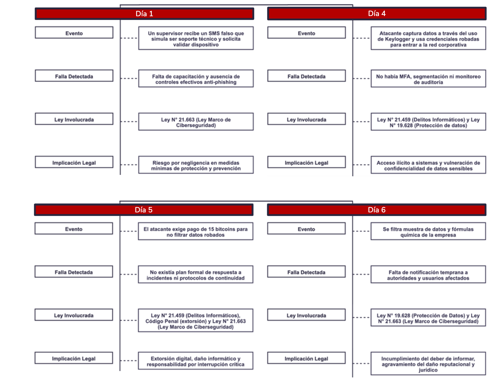

### Antecedentes adicionales

* Las bases de datos y los accesos por VPN utilizaban solo usuario y contraseña, sin autenticación multifactor (MFA).
* La empresa no contaba con políticas de respuesta a incidentes y no monitoreaba activamente.
* Las capacitaciones en ciberseguridad no eran periódicas y existían usuarios con privilegios excesivos.
* No se realizaban auditorías de seguridad interna desde hacía 18 meses.
* No se notificó oportunamente a la autoridad ni a los usuarios afectados, aludiendo a una evaluación en curso del incidente.

## Preguntas 

### 1. ¿El ingreso a los sistemas de Logística Austral fue ilegal?

En el caso, el atacante accede a los servidores internos utilizando credenciales obtenidas de forma fraudulenta mediante un SMS engañoso (técnica de 'smishing'), lo que constituye una intrusión no autorizada a un sistema informático protegido. Conforme a la **Ley N.º 21.459, específicamente su Artículo 2**, este acto configura el delito de **acceso ilícito a sistemas informáticos**, al establecerse que 'el que, sin la debida autorización, acceda a un sistema informático, ya sea mediante vulneración de medidas de seguridad o utilizando credenciales de acceso obtenidas de forma fraudulenta, será sancionado...' Por tanto, el acceso fue ilegal y tiene implicancias penales directas, agravadas además por afectar infraestructura crítica del país. En la citada Ley, el __Artículo 1 regula los deberes de seguridad y protección de datos__, mientras que el __Artículo 2 define la conducta delictiva de accesos no autorizados__ y establece su sanción penal.

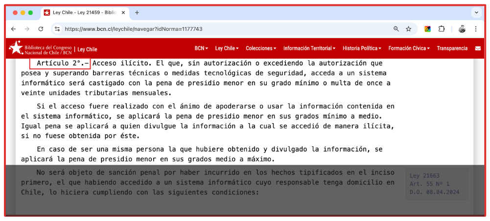
<a href="https://www.bcn.cl/leychile/navegar?idNorma=1177743&idParte=10343816">https://www.bcn.cl/leychile/navegar?idNorma=1177743&idParte=10343816</a>

También a esto se le aplica el Código Penal, específicamente el delito de Estafa (Artículo 467), ya que el SMS engañoso constituye un engaño que induce a error y causa un perjuicio económico.

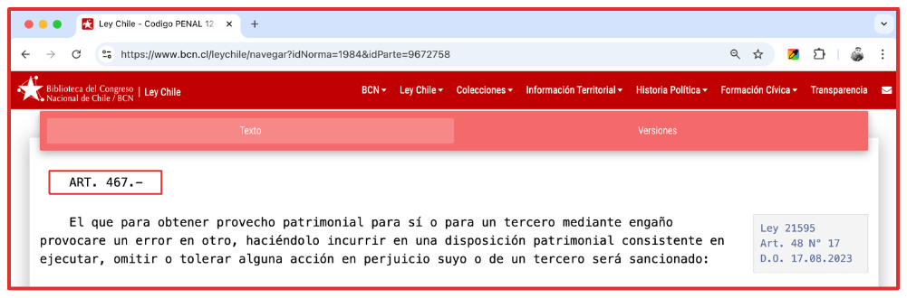
<a href="https://www.bcn.cl/leychile/navegar?idNorma=1984&idParte=9672758">https://www.bcn.cl/leychile/navegar?idNorma=1984&idParte=9672758</a>

### 2. ¿Se configura como "acceso ilícito a un sistema informático" según la ley?

Sí, según el caso, el acceso del atacante configura acceso ilícito a un sistema informático en el marco de la __Ley N°21.459__ (Artículo 2), al ingresar sin autorización mediante credenciales obtenidas con técnicas miliciosas (instalación de un _Keylogger_).

:::row center
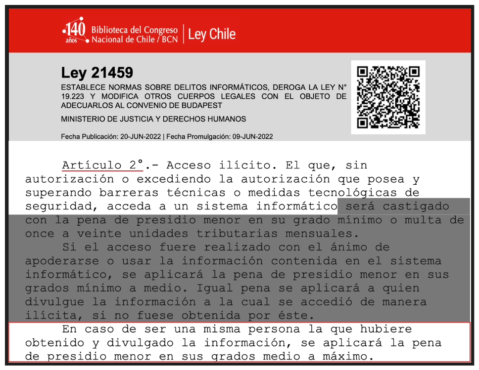

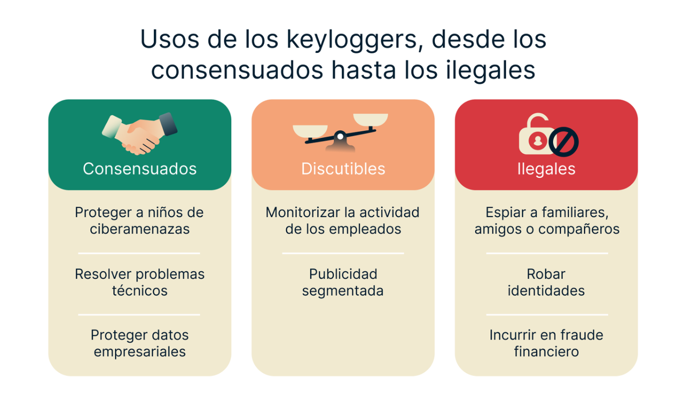
:::

El artículo también establece una excepción a la responsabilidad penal, condicionada al cumplimiento de una serie de numerales dentro del inciso correspondiente. Sin embargo, en el caso del atacante, **no cumpliría ninguna de las condiciones establecidas**, ya que no está registrado en la ANCI, no fue coordinado con Logística Austral, no informó a las autoridades y tuvo intenciones de cometer el ilícito.

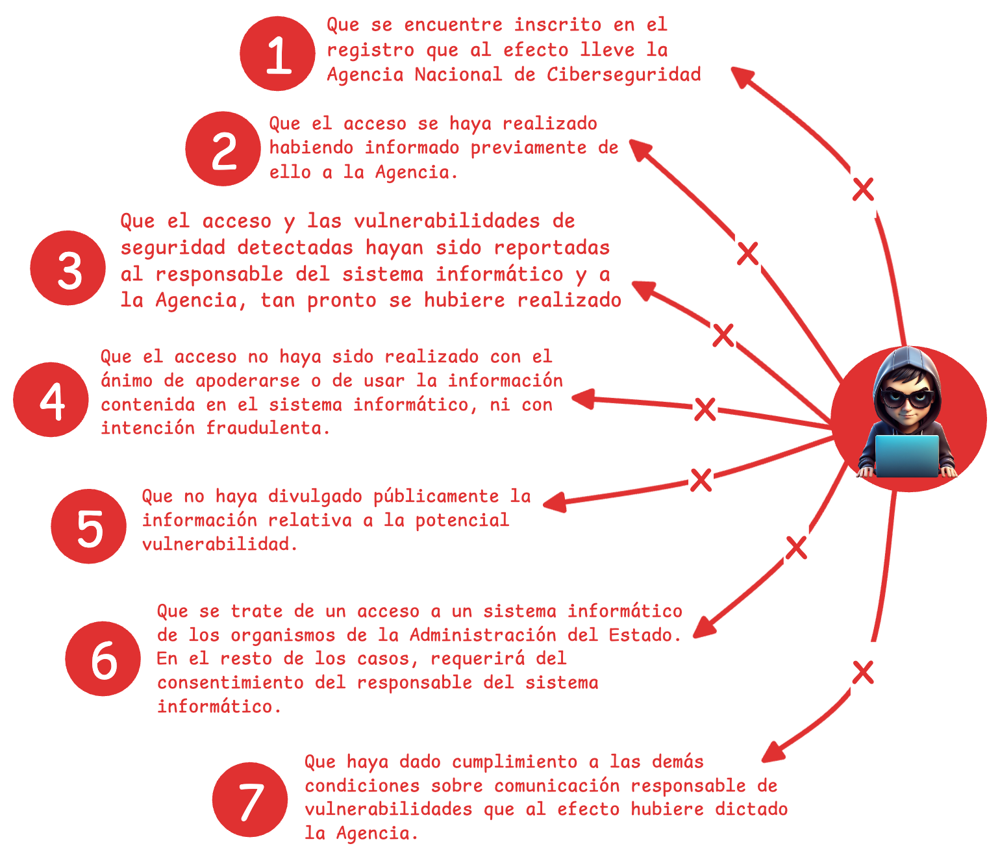

### 3. ¿Puede imputarse penalmente la instalación del malware tipo keylogger y backdoor?

Sí, puede imputarse penalmente conforme al **Artículo 8° de la Ley N° 21.459**, que sanciona el **abuso de dispositivos**.

La instalación del keylogger y backdoor constituye un delito por sí misma, independientemente de que haya causado daños directos iniciales. El **Artículo 8° de la Ley N° 21.459** sanciona de forma autónoma la obtención, entrega o difusión de programas maliciosos, sin necesidad de que se haya producido un daño adicional.

La ley castiga la **peligrosidad abstracta** de estas herramientas, están creadas específicamente para facilitar delitos informáticos (acceso ilícito del Art. 2° e interceptación del Art. 3°), con independencia de que luego se usen efectivamente para causar daños.

El **Artículo 10** de la Ley N.º 21.459 establece circunstancias agravantes que concurren en este caso:

1. **Afectación a servicios de utilidad pública**: Logística Austral gestiona la "última milla" de medicamentos críticos, vacunas e insumos oncológicos. El ataque paralizó los sistemas de despacho, afectando la cadena de suministro de salud.
2. **Abuso de posición de confianza**: El atacante utilizó credenciales obtenidas mediante engaño al supervisor, quien confió en la legitimidad del SMS.

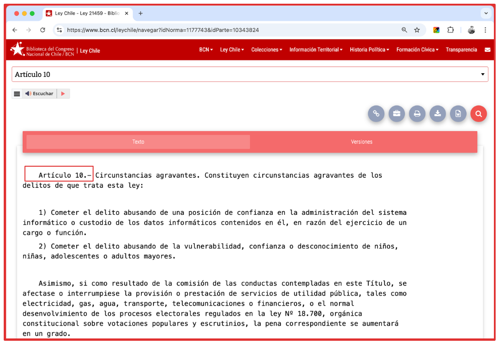
<a href="https://www.bcn.cl/leychile/navegar?idNorma=1177743&idParte=10343824">https://www.bcn.cl/leychile/navegar?idNorma=1177743&idParte=10343824</a>

### 4. ¿Qué artículo sanciona esta conducta?

El artículo que sanciona esta conducta es el **Artículo 8° de la Ley N° 21.459**, que castiga el abuso de dispositivos y además el atacante utiliza programas computacionales creados principalmente para cometer los delitos tipificados en los artículos 2° y 3° de la misma ley

¹ <a href="https://www.bcn.cl/leychile/navegar?idNorma=1177743&idParte=10343822">Ley N° 21.459, Artículo 8°</a>:
> "Artículo 8°.- Abuso de dispositivos. El que, para la perpetración de alguno de los delitos previstos en los artículos 2° y 3°, produjere, importare, distribuyere, ofreciere, vendiere, adquiriere para su uso, poseyere o facilitare a otro uno o más dispositivos, programas computacionales, contraseñas, códigos de seguridad o de acceso u otros datos similares, creados o adaptados principalmente para la perpetración de dichos delitos, será castigado con la pena de presidio menor en su grado mínimo y multa de cinco a diez unidades tributarias mensuales."

² <a href="https://www.bcn.cl/leychile/navegar?idNorma=1177743&idParte=10343816">Ley N° 21.459, Artículo 2°</a>:
> "Artículo 2°.- Acceso ilícito. El que, sin autorización o excediendo la autorización que posea, acceda a un sistema informático, ya sea mediante vulneración de medidas de seguridad o utilizando credenciales de acceso obtenidas de forma fraudulenta, será sancionado con la pena de presidio menor en su grado mínimo o multa de once a veinte unidades tributarias mensuales."

³ <a href="https://www.bcn.cl/leychile/navegar?idNorma=1177743&idParte=10343817">Ley N° 21.459, Artículo 3°</a>:
> "Artículo 3°.- Interceptación ilícita. El que indebidamente intercepte, interrumpa o interfiera, por medios técnicos, la transmisión no pública de información en un sistema informático, será sancionado con la pena de presidio menor en su grado medio."

---

### 5. ¿Existió sabotaje, daño, alteración o eliminación de datos?

Si, existió un __sabotaje__, un __daño en el sistema informático__ y además una __alteración__ de este, ya que el ataque DDoS ejecutado en el quinto día paralizó por completo la logística de la cadena fría, afectando directamente los sistemas de despacho. Según la Ley __N°21.459__, se estarían infringiendo los siguientes artículos: __Artículo 1__, __Artículo 2__ y __Artículo 3__.

El daño informático no se limita a borrar o modificar archivos. También abarca cualquier acción que **obstaculice o impida el normal funcionamiento** de un sistema, haciendo que este no esté disponible para los fines para los que fue diseñado. En este caso, el ataque DDoS paralizó la salida de los camiones refrigerados, lo que significa que el sistema de despacho quedó inoperativo. Ese bloqueo funcional es, en esencia, un daño al sistema, porque la empresa perdió temporalmente la capacidad de usar su propia infraestructura tecnológica para cumplir con su objetivo social.

Reflexionando sobre el caso, el ataque DDoS sí produjo efectos que son constitutivos de daño informático, porque afectó la disponibilidad del sistema de despacho, paralizó operaciones críticas y generó un riesgo cierto de daño a la salud pública.

### 6. ¿Podría aplicarse la figura de “daño informático” aunque los datos solo hayan sido copiados?

Puede aplicarse la figura de __daño informático__ al caso, ya que de todos modos el atacante decidió usar su influencia en el sistema para detener el funcionamiento normal del mismo, además de subir las muestras de las fórmulas y datos sensibles en la dark web a modo de respuesta a la empresa por no recibir el pago de la extorsión.

Ahora, el simple acceso y copia no autorizada constituyen una afectación relevante en seguridad, porque vulnera la **confidencialidad**, uno de los tres pilares de la tríada CIA (Confidencialidad, Integridad, Disponibilidad). Aunque los datos originales no se modifiquen ni se borren, la pérdida de control sobre la información genera un perjuicio real y exposición de datos sensibles, daño reputacional y riesgo de extorsión, como ocurre en este caso con Logística Austral con los 45 GB de datos médicos y de propiedad intelectual copiados.

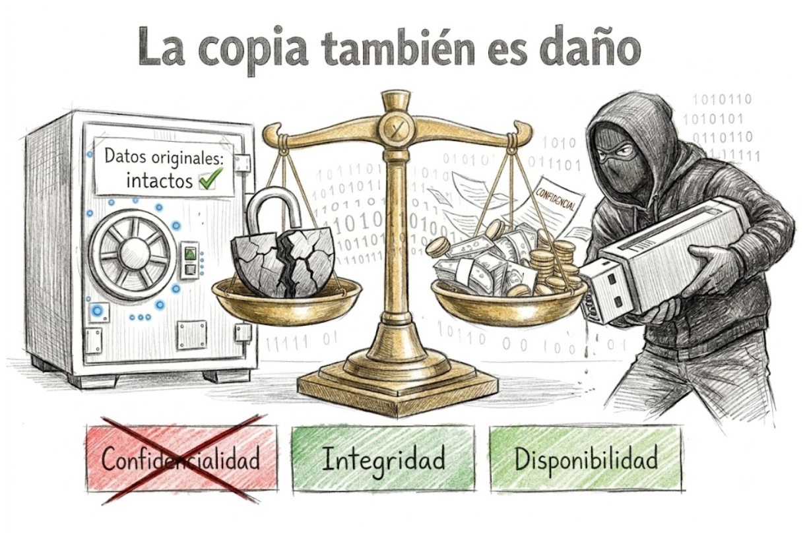

::::row
:::insise
### Confidencialidad 
Asegura que solo las personas autorizadas accedan a la información.

**Daño asociado:**
Ocurre cuando hay filtración de datos, robo de contraseñas o acceso no autorizado a archivos privados.
:::
:::insise
### Integridad 

Garantiza que la información sea exacta y no haya sido alterada sin autorización.

**Daño asociado:**
Se produce cuando se modifican registros bancarios, se altera el código de un software o se eliminan archivos críticos de forma malintencionada.
:::
:::insise
### Disponibilidad

Garantiza que los datos y sistemas estén accesibles cuando se necesiten.

**Daño asociado:**
Se ve afectada cuando ocurren ataques de denegación de servicio (DDoS), infecciones por ransomware.
:::
::::

### 7. ¿El correo exigiendo criptomonedas constituye “extorsión”?

Sí, el correo que exige el pago de 15 Bitcoins (14.375 UTM, 1.004.666.507 pesos chilenos aproximados) bajo la amenaza de divulgar los datos médicos y las fórmulas químicas **sí constituye el delito de extorsión**, conforme al artículo 438 del Código Penal chileno.

Para que una conducta sea calificada como extorsión, deben concurrir tres elementos, los cuales se cumplen en este caso:

*   **Una amenaza ilícita**: La acción del atacante de hacer pública la base de datos de 45 GB con información sensible cumple con este requisito. En el contexto del delito, la amenaza no requiere ser de un daño físico, sino que también puede consistir en la **revelación de secretos o la destrucción de la reputación**, lo cual es exactamente el perjuicio que se le está comunicando a Logística Austral.
*   **Un ánimo de lucro**: La exigencia concreta de un pago de 15 Bitcoins constituye la búsqueda de un **provecho patrimonial**, el cual es un elemento central de este delito.
*   **La existencia de un vínculo de condicionalidad**: El correo establece una condición explícita y una consecuencia directa: "entregue el dinero a cambio de no divulgar los datos". Esta estructura "si no pagas, hago público X" configura la **coacción o intimidación** que define a la extorsión.

En este caso, la extorsión se agrava por la naturaleza de la información amenazada: datos médicos de pacientes oncológicos y propiedad intelectual en fase de prueba clínica. La divulgación no solo afectaría la reputación de Logística Austral, sino que podría causar un daño directo a la salud de los pacientes y a los derechos de propiedad industrial de la empresa.

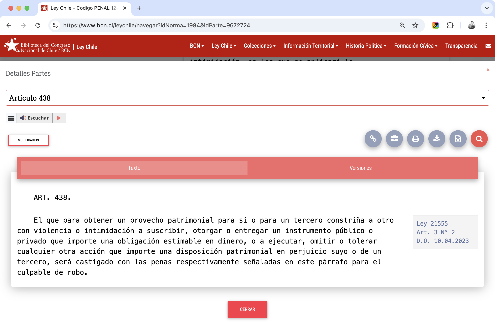

### 8. ¿Qué fallos de seguridad permitieron el ataque?

Dentro de la empresa, nunca se implementaron distintos métodos de seguridad para proteger los sistemas.

Los fallos de seguridad que permitieron el ataque fueron:

1. **Error humano:** El supervisor hizo clic en un SMS falso (smishing) e ingresó sus credenciales.
2. **Falta de MFA:** No había autenticación de dos factores para la VPN.
3. **Ausencia de segmentación de red:** La red administrativa y la de operaciones no estaban separadas, permitiendo movimiento lateral.
4. **Privilegios excesivos:** La cuenta del supervisor tenía acceso a servidores centrales y datos sensibles.
5. **Antivirus insuficiente:** No detectó la instalación del keylogger y backdoor.
6. **Falta de monitoreo:** La exfiltración de 45 GB no generó alertas.
7. **Sin control de aplicaciones:** El equipo permitió instalar software malicioso.
8. **Inexistencia de respuesta a incidentes:** No se aisló el equipo comprometido a tiempo.

A lo anterior se suman fallos organizativos: no se implementaron los protocolos de la **Ley N° 21.663** (reportes a la ANCI en 3 y 72 horas), no hubo auditorías en 18 meses, las capacitaciones en ciberseguridad no eran periódicas (lo que facilitó el error humano del smishing), y la empresa no notificó a las autoridades ni a los usuarios afectados, argumentando que aún evaluaba el alcance.

---

### 9. ¿Existían políticas de control de acceso y cifrado de datos?

Haciendo énfasis en la pregunta anterior, la empresa no contaba con políticas de control de acceso y cifrado de datos formales que regulen el acceso a información sensible y la protección de datos en tránsito y reposo. Debido a la falta de presencia de los métodos mencionados, se le facilitó la entrada ilícita del atacante al sistema informático, además de irrumpir el funcionamiento normal de este y la filtración de datos.

En consecuencia, la empresa no cumplió con los deberes de seguridad establecidos en la **Ley N° 21.663** (Ley Marco de Ciberseguridad) ni con el **Artículo 1° de la Ley N° 21.459**, que regula los deberes de resguardo de datos personales. Adicionalmente, la empresa omitió reportar el incidente a la ANCI dentro de los plazos máximos de 3 y 72 horas, agravando su responsabilidad legal.

---

### 10. ¿Se cumplían los estándares mínimos de ciberseguridad exigidos por la ley?

Logística Austral Ltda. no cumplía con los estándares mínimos de ciberseguridad exigidos por las __leyes N° 21.459, N° 19.628 y los estándares ISO/IEC 27001__. porque durante el ataque no se han protegido los datos de los clientes, tampoco la integridad del sistema y no se han seguido las cláusulas del SGSI para controlar el problema.

### 11. ¿La empresa realizaba auditorías de seguridad periódicas?

No, no existían auditorías periódicas ni una política formal de revisión de seguridad de sistemas y bases de datos.

La propia historia del caso indica que la empresa **no realizó auditorías de seguridad en los últimos 18 meses**. Se trata de una carencia documental y procedimental total: no solo no se ejecutaban las auditorías, sino que tampoco existía una política documentada que regulara su frecuencia, alcance o metodología.

Logística Austral, al gestionar la "última milla" de medicamentos críticos (vacunas, insumos oncológicos), califica como **Operador de Importancia Vital (OIV)** en el sector salud conforme a la **Ley N° 21.663 (Ley Marco de Ciberseguridad)**. Como OIV, la ley le exige **someterse a revisiones periódicas para demostrar que sus defensas son reales y no solo "papel"**, así como implementar un **Sistema de Gestión de Seguridad de la Información (SGSI)** basado en una práctica continua. La ausencia total de auditorías constituye una **infracción grave** a la Ley N° 21.663, sancionable con multas de hasta 10.000 UTM.

---

### 12. ¿Existía un plan de respuesta ante incidentes?

**No, no existía un plan de respuesta a incidentes.** La empresa actuó de forma reactiva: no detectó el malware, no aisló el equipo comprometido, no contuvo el movimiento lateral ni la exfiltración. Tampoco notificó a la ANCI dentro de las 3 horas posteriores al ataque (incumpliendo la Ley N° 21.663), argumentando que "aún evaluaba el alcance". Sin un plan formal, la respuesta fue tardía e ineficaz.

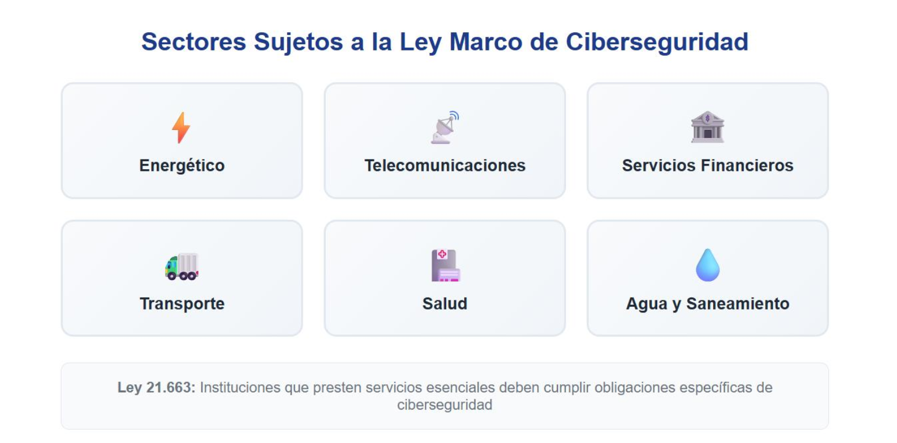

En conclusión, Logística Austral no contaba con un plan de respuesta a incidentes y su reacción fue tardía e ineficaz, incumpliendo gravemente sus obligaciones legales como Operador de Importancia Vital.

### 13. ¿Cómo debería responder la empresa ante el incidente según la ley?

Según los __Artículos 4, 9, 27 y 32__ de la __Ley N° 21.663__, la empresa debería responder con reportes inmediatos del incidente con un plazo obligatorio de _3 horas desde que se tiene en conocimiento_. _Dentro de 72 horas posterior_ a la primera notificación, se debe _entregar una actualización_ que incluye la evaluación inicial del incidente, su gravedad e impacto, debe incluir indicadores de compromiso (si están disponibles). Finalmente, si la empresa es considerada Operador de Importancia Vital, deben entregar en un _plazo máximo de 15 días_ un informe detallado sobre el incidente, incluyendo gravedad e impacto, el tipo de amenaza que se presentó, las medidas de mitigación aplicadas y en curso, y si procede se deben mencionar las repercusiones transfronterizas.

---

### 14. ¿Qué acciones urgentes debe tomar para contener el daño?

Como propuesta(s) urgentes para la empresa, se debe aislar el/los sistema(s) afectados desconectando físicamente los equipos comprometidos, aislar el/los servidor(es), backups realizados y bases de datos. También se recomienda preservar la(s) evidencia(s) para la colaboración de la investigación, realizar análisis forenses, notificar a las autoridades correspondientes (CSIRT Nacional) junto a los clientes y socios sobre el ataque detectado, además de implementar nuevas medidas de seguridad como recomendar cambiar de contraseña a una más robusta.

---

### 15. ¿A qué autoridades debe notificar?

Tras la vigencia de la __Ley N° 21.663__ "Ley Marco de Ciberseguridad" desde 1 de marzo de 2025, los organismos están obligados a reportar los incidentes principalmente a la __Agencia Nacional de Ciberseguridad__ _(ANCI)_. Dentro de la ley, las empresas tienen 3 --oficinas-- en donde recurrir, dependiendo del contexto del ataque y el motivo del mismo _(CSIRT Nacional, CSIRT de la Defensa Nacional, Brigada Investigadora del Cibercrimen - PDI)_. En el caso de Logística Austral Ltda., debe reportar directamente a la __ANCI__.

### 16. ¿Se vulneró el principio de confidencialidad y seguridad de los datos?

Según el __Artículo 2__ _inciso G_, __Artículo 7__, __Artículo 10__ y __Artículo 11__ que forman parte de la __Ley N° 19.628__, si se confirma que Logística Austral Ltda. ha vulnerado los principios de confidencialidad y seguridad de los datos al no implementar los métodos de seguridad obligatorios mencionados en la __Ley N° 21.663__ y la __Norma ISO/IEC 27001__.

### 17. ¿Se protegieron los datos personales de acuerdo con la ley?

Se menciona explícitamente que la empresa no ha protegido los datos personales con las medidas técnicas y organizacionales suficientes. El servidor junto la base de datos no contaban con cifrado de datos, segmentación, autenticación de doble factor y la empresa no contaba con un protocolo para actuar bajo un ataque cibernético.

### 18. ¿Qué responsabilidad tiene la empresa por la filtración?

La _responsabilidad civil, administrativa y penal_ que están fundamentadas por ambas __Leyes N° 19.628 y N° 21.459__ castigan severamente a la empresa Logística Austral Ltda. y obligan a pagar una indemnización por la causal de dañar el patrimonio y/o la moral del usuario, las multas van dependiendo de la gravedad del caso, aunque generalmente se decreta pagar entre 1 a 10 UTM, incluso la autoridad puede imponer medidas de seguridad para subsanar las brechas de seguridad detectadas. Finalmente se considera a la empresa como responsable de los daños causados, además implican sanciones por incumplir los protocolos de seguridad y protección de datos, pérdida total o parcial de beneficios fiscales, prohibición temporal o perpetua de contratar con el estado y disolución o cancelación de la personalidad jurídica (si aplica en casos extremos).

### 19. ¿Incumplió su deber de proteger los datos?

Logística Austral Ltda. si omitió/incumplió las implementaciones de los principios de seguridad, proporcionalidad y necesidad. Al no contar con protocolos fundamentales en el momento del ataque, se infiere que la empresa, y por lo tanto la gerencia, no supo que hacer en el momento y decidieron tratar de ocultar los hechos.

### 20. ¿Omitió notificar a los afectados y a la autoridad de control? 

La empresa si omitió notificar a los afectados, a las autoridades y a la prensa en el momento de sufrir el ataque. Según los _Artículos 7, 8 y 9_ de la __Ley N° 21.663__ exigen que se activen los protocolos de aviso hacia los organismos correspondientes en tiempos acotados, además de cumplir con las normas de protección de los datos.

### 21. ¿Qué tipos de datos personales fueron comprometidos que están específicamente protegidos por el GDPR?

Según el __Reglamento General de Protección de Datos__, se vieron comprometidos los siguientes aspectos de la empresa Logística Austral Ltda.: Datos personales básicos (Nombres, Apellidos, Números de teléfonos, Correos Electrónicos) y Datos sensibles (Información clasificada de la Salud, como los expedientes médicos de los pacientes e información médica oncológica).

### 22. Si Logística Austral tuviera clientes/laboratorios en la Unión Europea, ¿qué obligaciones tendría bajo el GDPR tras detectar la filtración? 

Si la empresa estuviera bajo el seno del __Reglamento General de Protección de Datos__, tendría la obligación de seguir estrictamente _los incisos del Artículo 33_ que dictan lo siguiente: En caso de violación de datos personales, el responsable del tratamiento notificará sin demora indebida y, cuando sea posible, a más tardar 72 horas después de haber tenido conocimiento de ella. Cuando la notificación a la autoridad no se realice dentro del plazo estimado, deberá ir acompañada de los motivos del retraso. El contenido de la notificación debe mencionar la naturaleza de la violación de datos personales, comunicar el nombre y datos de contacto del Delegado de Protección de Datos, las posibles consecuencias de la violación de datos personales y describir las medidas propuestas por el responsabe para abordar la problemática, incluidas las medidas de mitigación los posibles efectos adversos, si aplica. Finalmente, el responsable del tratamiento documentará cualquier violación de datos personales, incluyendo los hechos relacionados con la violación de datos personales, sus efectos y las medidas correctivas adoptadas.

### 23. ¿Qué elementos de la base de datos comprometida podrían ser considerados "Protected Health Information (PHI)" bajo la normativa HIPAA? 

Los elementos de la base de datos de la empresa que están comprometidos y son considerados Protected Health Information serían los Nombres, Apellidos, RUT, Direcciones, Contacto (tanto número de teléfono como correo electrónico), Tipo de Afiliaciones en la Salud, Historial Médico, Resultados Emitidos de Laboratorios y Diagnósticos.

### 24. Si brindara servicios a entidades de salud en EE. UU., ¿qué consecuencias podría enfrentar por la filtración de datos médicos bajo HIPAA?

Si la empresa brindara servicios a entidades de salud en Estados Unidos e infringe las normas HIPAA, se enfrenta a dos principales sanciones. La primera sanción le cobra una multa económica por parte de la Oficina de Derechos Civiles (OCR) del Departamento de Salud y Servicios Humanos (HSS), el valor de la multa puede variar desde los $100 dólares hasta más de $60,000 dólares por infracción detectada, con un tope máximo anual de $2.000.000 dólares para violaciones reiteradas. La segunda sanción proviene del Departamento de Justicia y determina si la información de información protegida fue obtenida y/o divulgada con intención maliciosa o para beneficio personal, en el caso de tener conocimiento sobre esta información se decreta hasta máximo 1 año de prisión, entregar falsos pretextos ante el jurado se decreta hasta 5 años de prisión, finalmente si se corrobora una intención maliciosa o de lucro se decreta hasta 10 años de prisión. Se pueden recurrir a acuerdos de resolución con planes supervisados por el gobierno, pero a cambio se daña la reputación de la empresa, perdiendo pacientes y credibilidad en el mercado, y se limitan las acciones profesionales como una suspensión de licencias.

### 25. ¿Qué lecciones pueden aprender las empresas de logística crítica del cumplimiento de normativas internacionales tras un incidente como este? 

Las empresas de logística crítica pueden aprender como principal lección que el cumplimiento normativo no debe considerarse como un aspecto opcional, sino como un componente esencial de la continuidad operacional y de la gestión de riesgo. Incidentes como la situación de Logística Austral Ltda. evidencian la necesidad de adoptar y mantener estándares y marcos regulatorios internacionales aplicables, como el __Reglamento General de Protección de Datos__ _(GDPR)_, la __Ley de Portabilidad y Responsabilidad de Seguros de Salud__ _(HIPAA)_ y la __Norma ISO/IEC 27001__. 

En este contexto, la protección de datos sensibles, en especial la información médica y propiedad intelectual, se considera crítica ya que su exposición puede generar consecuencias reputacionales severas, pérdida de confianza de los clientes y socios estratégicos, sanciones administrativas y económicas significativas. 

Para prevenir incidentes similares, las organizaciones deben implementar controles técnicos y organizacionales adecuados, como la _autenticación multifactor_ en accesos remotos, segmentación de redes, aplicación del principio de mínimo privilegio, monitoreo continuo de logs, auditorías periódicas y capacitaciones recurrentes frente a amenazas como smishing y phishing. 

Asimismo, resulta indispensable contar con un plan formal de respuesta a incidentes que permita contener el ataque, evaluar el impacto y ejecutar procesos de notificación según las obligaciones establecidas en la norma aplicable. Finalmente, estas medidas deben complementarse con el cumplimiento de la legislación nacional vigente, asegurando una gestión integral de la seguridad de la información y la protección en contextos tanto locales como internacionales.

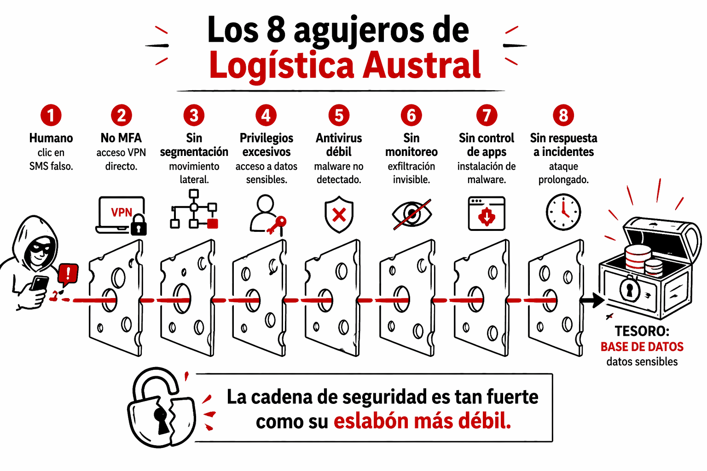

