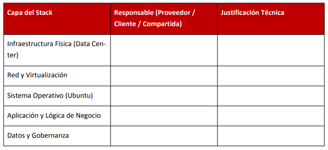
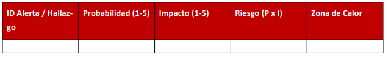
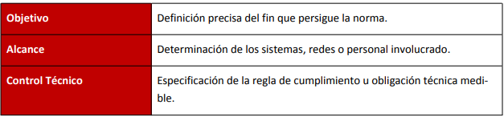
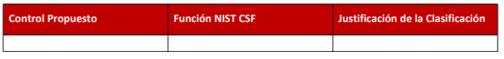
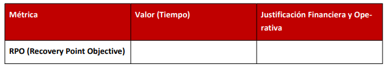
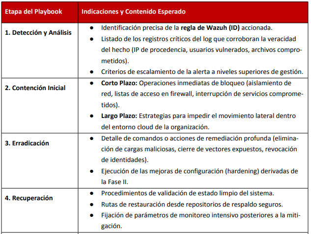
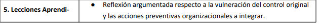

:::portada

# Caso de estudio
## SecureLogistics S.A

__Marco Contreras__  
&nbsp;&nbsp;[marco.contreras11@inacapmail.cl](mailto:marco.contreras11@inacapmail.cl)

__Benjamín Caba__  
&nbsp;&nbsp;[benjamin.caba@inacapmail.cl](mailto:benjamin.caba@inacapmail.cl)

 

__Docente__: Marcos Nathanael Rodríguez Cerda
:::

## Contexto del caso

El área de seguridad a dejado accesible deliberadamente un servidor de contingencia con __Ubuntu 24.04 LTS__ hacia internet con el fin de auditar la postura de defensa externa. Este servidor está enlazado a la consola de __Wazuh SIEM__.

### Datos para ingresar a la consola de administración de Wazuh

- __IP__: `https://172.234.205.157/`
- __Usuario__: `usuario8`
- __Password__: `**********`

---

## I. Arquitectura y Responsabilidad

* Análisis Sectorial y Legal: El equipo justificará el nivel de impacto de una vulneración considerando los requerimientos del sector farmacéutico y la Ley 19.628.
* Tríada CIA: Los estudiantes definirán las consecuencias operativas específicas en caso de verse
comprometida la Confidencialidad, Integridad o Disponibilidad de la plataforma.
Empleando la siguiente tabla, el grupo delimitará las responsabilidades técnicas según el modelo IaaS:

## II. Análisis de Causa Raíz (RCA) - Técnica de los "5 Porqués"

* El grupo seleccionará uno de los eventos ofensivos registrados en Threat Hunting y lo relacionará directamente con uno de los errores identificados en Configuration Assessment. Se aplicará la técnica de los "5 Porqués" para trazar la ruta desde el incidente hasta el error administrativo de origen.
* Nota Crítica: El hallazgo de configuración elegido debe poseer una conexión técnica lógica como facilitador del ataque. Ej. Acceso SSH exitoso derivado de contraseñas débiles por ausencia de políticas PAM. El equipo debe desarrollar obligatoriamente los 5 niveles de profundidad hasta llegar a la falla de proceso o gestión corporativa.
Preguntas a responder en su análisis:
    1. ¿Por qué el atacante logró ejecutar esta acción o aprovechar este síntoma inicial en el servidor?
    2. ¿Por qué el sistema operativo presentaba esa vulnerabilidad o exposición?    
    3. ¿Por qué el servidor estaba configurado de esa manera insegura?
    4. ¿Por qué el equipo de TI o seguridad no implementó dicho control antes de exponer el servidor de contingencia a Internet?
    5. ¿Por qué se permitió que el equipo operara con esos procesos deficientes?

## III. Evaluación Cuantitativa y Matriz de Riesgo 

Para cada uno de los tres incidentes extraídos, el equipo completará la tabla inferior:

Justificación de Probabilidad: Se considerarán valores altos (4-5) ante eventos con múltiples ocurrencias diarias; medios (3) ante repeticiones semanales; y bajos (1-2) si representan incidencias aisladas.
Heatmap (5x5): El grupo realizará la matriz y ubicará de forma gráfica los riesgos calculados, asignándolos a las siguientes zonas numéricas: INACEPTABLE (15-25), SIGNIFICATIVO (8-14), MODERADO (4-7) o ACEPTABLE (1-3). Crear una tabla de 5x5 coloreada para representar la zona de calor.

## IV. Gobernanza y Controles

El equipo debe redactar dos políticas preventivas estructuradas bajo el siguiente formato:

Mapeo NIST CSF v2.0: Los estudiantes detallarán tres controles de mitigación, ubicándolos de acuerdo a las funciones del estándar internacional:

## V. Resiliencia y Disaster Recovery

Ante la hipótesis de un incidente de Ransomware consumado, el equipo dimensionará las estrategias de
recuperación considerando las pérdidas operativas dictadas ($15.000 USD/hora):

Finalmente, se presentará y justificará la elección del sitio de recuperación idóneo (Cold, Warm, Hot o Cloud DR) ponderando la balanza de costos de infraestructura frente a los perjuicios por inactividad prolongada.

## VI. Playbook de Respuesta Operativa

Como componente resolutivo final, cada pareja estructurará un Playbook Operativo de contingencia
exclusivo para la amenaza detectada durante la Fase II. El documento será estrictamente técnico, evidenciando el ciclo de respuesta adecuado.

