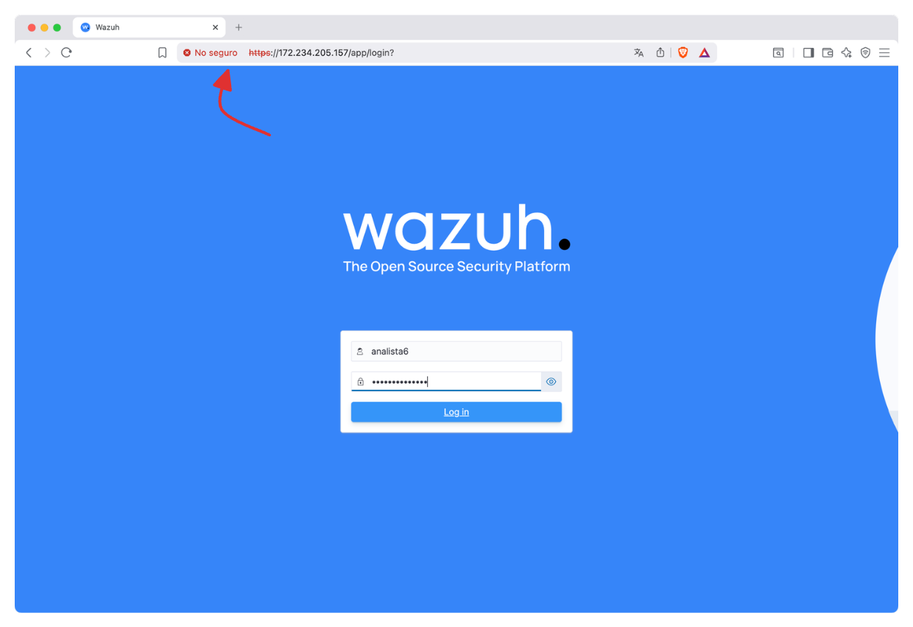
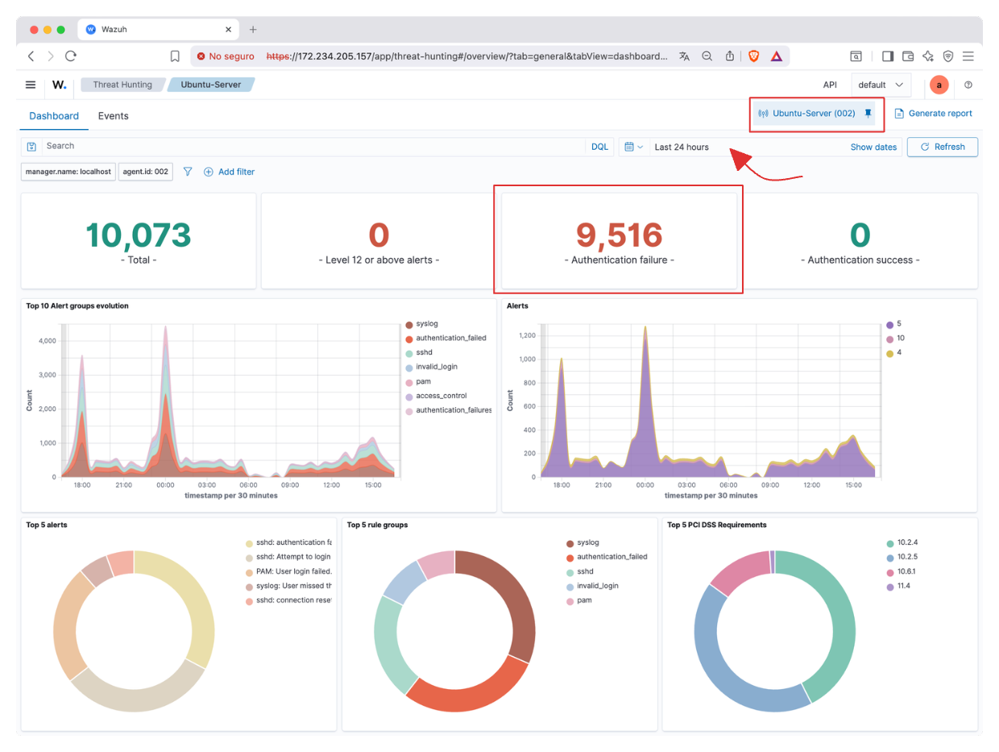
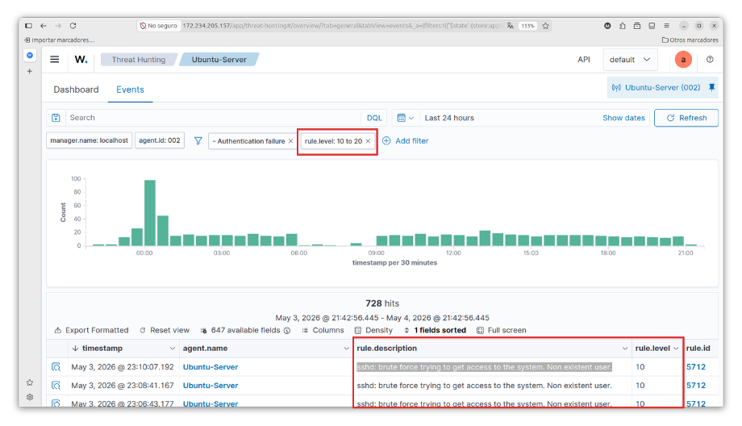
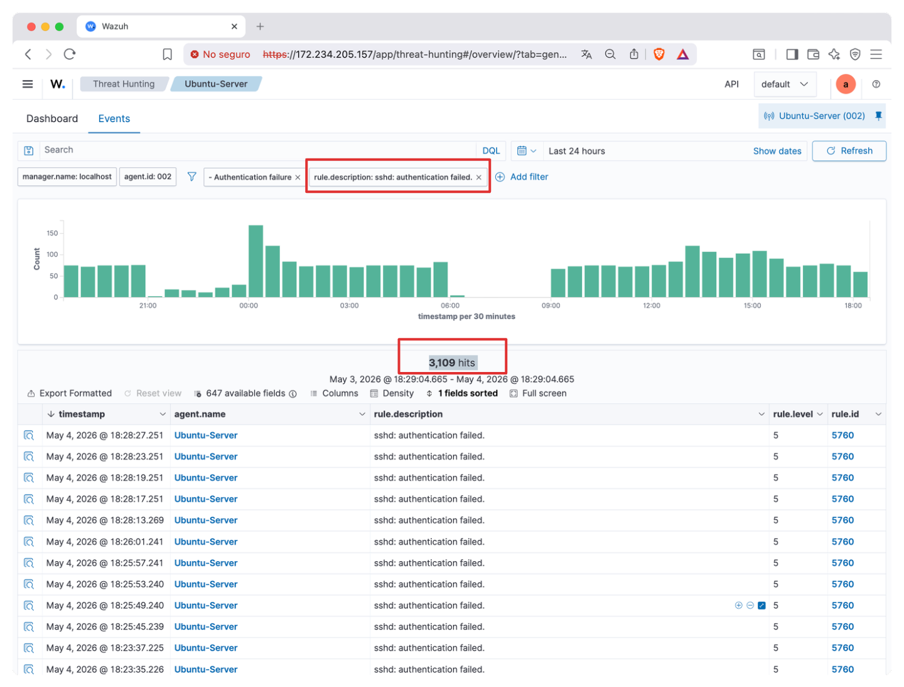
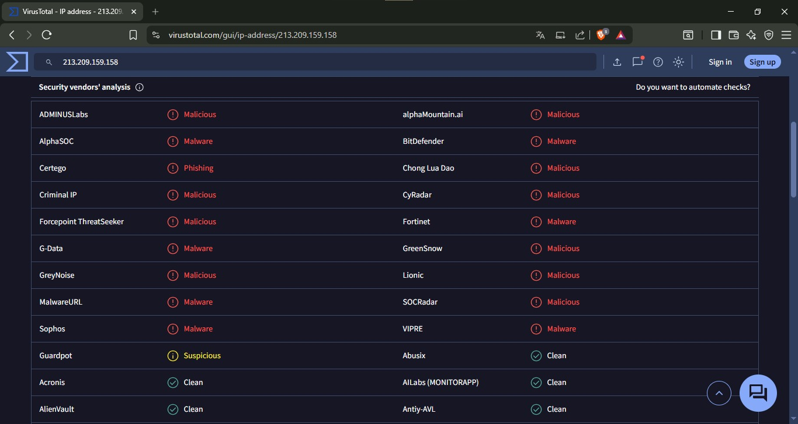

:::portada

# Caso de estudio
## SecureLogistics S.A

__Marco Contreras__  
&nbsp;&nbsp;[marco.contreras11@inacapmail.cl](mailto:marco.contreras11@inacapmail.cl)

__Benjamín Caba__  
&nbsp;&nbsp;[benjamin.caba@inacapmail.cl](mailto:benjamin.caba@inacapmail.cl)

 

__Docente__: Marcos Nathanael Rodríguez Cerda
:::

<h2 align="center">Índice</h2>

:::toc
  - [Contexto del caso](#contexto-del-caso)
    - [Datos para ingresar a la consola de administración de Wazuh](#datos-para-ingresar-a-la-consola-de-administración-de-wazuh)
  - [I. Arquitectura y Responsabilidad](#i-arquitectura-y-responsabilidad)
      - [1. **Confidencialidad (Brecha de datos)**](#1-confidencialidad-brecha-de-datos)
      - [2. **Integridad (Alteración de datos)**](#2-integridad-alteración-de-datos)
      - [3. **Disponibilidad (Interrupción del servicio)**](#3-disponibilidad-interrupción-del-servicio)
    - [Responsabilidades técnicas según el modelo IaaS](#responsabilidades-técnicas-según-el-modelo-iaas)
  - [II. Análisis de Causa Raíz (RCA) - Técnica de los "5 Porqués"](#ii-análisis-de-causa-raíz-rca---técnica-de-los-5-porqués)
  - [III. Evaluación Cuantitativa y Matriz de Riesgo](#iii-evaluación-cuantitativa-y-matriz-de-riesgo)
  - [IV. Gobernanza y Controles](#iv-gobernanza-y-controles)
  - [V. Plan de Tratamiento y Mitigación de Riesgos](#v-plan-de-tratamiento-y-mitigación-de-riesgos)
:::

## Contexto del caso

**SecureLogistics S.A.** dispone de una infraestructura crítica desplegada en la nube bajo un modelo IaaS, orientada a la conexión entre inventarios de laboratorios farmacéuticos y centros hospitalarios a nivel nacional. Esta plataforma procesa un alto volumen de transacciones y gestiona información médica altamente sensible, sujeta a normativas como la Ley 19.628 y la Ley Marco de Ciberseguridad.

El área de seguridad a dejado accesible deliberadamente un servidor de contingencia con __Ubuntu 24.04 LTS__ hacia internet con el fin de auditar la postura de defensa externa. Este servidor está enlazado a la consola de __Wazuh SIEM__ ( _Security Information and Event Management_ ).

### Datos para ingresar a la consola de administración de Wazuh

- __IP__: __`https://172.234.205.157/`__
- __Usuario__: __`analista6`__
- __Password__: __`**********`__

<small><strong>Figura 1.</strong> Pantalla de autenticación al panel de Wazuh</small>

> La IP corresponde al servidor de Wazuh que monitorea el equipo expuesto por el área de seguridad. El navegador indica __“No seguro”__ porque el certificado SSL no es válido al utilizar una dirección IP en lugar de un dominio.

A partir de este punto, el análisis presentado en el informe se desarrolla principalmente sobre la información obtenida desde la plataforma **Wazuh**, complementada con otras herramientas y mecanismos de seguimiento. Esto permite obtener una visión más completa del comportamiento del servidor expuesto y sustentar el análisis de seguridad que se abordará en los siguientes apartados.

Una vez seleccionado el agente que monitorea el servidor en Wazuh, se visualiza el dashboard correspondiente a las últimas 24 horas, donde se observa un alto número de eventos, destacando los intentos de autenticación fallidos.

 
<small><strong>Figura 2.</strong> Vista general del agente Wazuh en servidor Ubuntu</small>

Estos resultados entregan una visión general del estado del servidor, los cuales serán analizados en detalle en los siguientes apartados del informe.

## I. Arquitectura y Responsabilidad

**Análisis Sectorial y Legal**: El equipo justificará el nivel de impacto de una vulneración considerando los requerimientos del sector farmacéutico y la Ley N° 19.628.

El impacto de cualquier vulneración a un sistema informático que cumpla con los requisitos vigentes de la **Ley N° 21.663** (Ley Marco de Ciberseguridad), para ser considerado como un *Operador de Importancia Vital*, es de un nivel muy alto, ya que, además de afectar directamente su funcionamiento, puede generar pérdidas de **$15.000 USD por cada hora de inactividad**, recibir penalizaciones por parte de la justicia chilena y, finalmente, como empresa, existe el riesgo de una ruptura en la cadena de frío de medicamentos oncológicos críticos.

Según la **Ley N° 19.628** (Protección de la Vida Privada), la sanción puede aplicarse como una indemnización por el daño patrimonial derivado del tratamiento indebido de datos. El monto es establecido por el juez, dependiendo de la gravedad del caso y su impacto. Asimismo, se establece que la empresa es responsable de almacenar de forma confidencial los datos de sus clientes.

> [https://www.bcn.cl/leychile/navegar?idNorma=141599&idParte=8642708](https://www.bcn.cl/leychile/navegar?idNorma=141599&idParte=8642708) **Art. 23, Ley N° 19.628**
> [https://www.bcn.cl/leychile/navegar?idNorma=141599&idParte=8642683](https://www.bcn.cl/leychile/navegar?idNorma=141599&idParte=8642683) **Art. 2, inciso g, Ley N° 19.628**
> [https://www.bcn.cl/leychile/navegar?idNorma=1202434&idParte=10496166](https://www.bcn.cl/leychile/navegar?idNorma=1202434&idParte=10496166) **Art. 4, Ley N° 21.663**
> [https://www.bcn.cl/leychile/navegar?idNorma=1202434&idParte=10496167](https://www.bcn.cl/leychile/navegar?idNorma=1202434&idParte=10496167) **Art. 5, Ley N° 21.663**

Como evidencia técnica, al aplicar un filtro de severidad (**`rule.level`** entre 10 y 20) en la plataforma Wazuh, se identifican múltiples eventos del tipo *“sshd: brute force trying to get access to the system. Non existent user”*. Estos registros corresponden a intentos de acceso no autorizado mediante ataques de fuerza bruta dirigidos al servicio SSH, en los cuales se utilizan usuarios inexistentes, lo que evidencia un comportamiento automatizado orientado a vulnerar el sistema.

 
<small><strong>Figura 3.</strong> Evidencia de ataques de fuerza bruta</small>

La recurrencia y el volumen de estos eventos permiten inferir la existencia de una amenaza activa, capaz de comprometer tanto la disponibilidad como la seguridad de la infraestructura. En este contexto, un ataque exitoso o sostenido podría derivar en la degradación o interrupción del servicio, generando impactos operacionales significativos.

En un entorno del sector farmacéutico, donde la continuidad operativa es crítica, este tipo de incidentes adquiere un nivel de severidad elevado. Una eventual indisponibilidad del sistema podría afectar procesos esenciales, como la gestión y conservación de medicamentos oncológicos sensibles, comprometiendo la cadena de frío. Asimismo, una vulneración que implique acceso indebido a información podría constituir un incumplimiento de las disposiciones establecidas en la Ley N° 21.663 (Ley Marco de Ciberseguridad) y la Ley N° 19.628 (Protección de la Vida Privada), exponiendo a la organización a sanciones legales y responsabilidades por el tratamiento inadecuado de datos personales.

__Tríada CIA__: Como equipo definirán las consecuencias operativas específicas en caso de verse
comprometida la Confidencialidad, Integridad o Disponibilidad de la plataforma.

En caso de verse comprometida la seguridad de la plataforma de **SecureLogistics S.A.**, se generarían las siguientes consecuencias operativas:

#### 1. **Confidencialidad (Brecha de datos)**

* **Filtración de información médica:** Un acceso no autorizado podría exponer historiales clínicos y datos sensibles de pacientes oncológicos.
* **Sanciones legales:** La vulneración de la Ley N° 19.628 podría derivar en multas e indemnizaciones por el tratamiento indebido de datos personales.
* **Daño reputacional:** Pérdida de confianza por parte de laboratorios y centros hospitalarios a nivel nacional.

#### 2. **Integridad (Alteración de datos)**

* **Decisiones erróneas:** La manipulación de inventarios podría provocar envíos incorrectos de medicamentos, afectando directamente la salud de los pacientes.
* **Registros adulterados:** Alteración de datos críticos como la temperatura, ocultando fallas en la cadena de frío.
* **Compromiso del sistema:** Software malicioso podría modificar la lógica de negocio, afectando la operación del sistema.

#### 3. **Disponibilidad (Interrupción del servicio)**

Como se muestra en la __figura 3__, los intentos de acceso por fuerza bruta al servicio SSH evidencian una amenaza activa que puede comprometer la disponibilidad del sistema.

* **Interrupción operativa:** La caída de la infraestructura genera pérdidas estimadas de $15.000 USD por hora.
* **Ataques de ransomware:** El secuestro de sistemas impediría la continuidad de las operaciones logísticas.
* **Pérdidas críticas:** La imposibilidad de gestionar despachos puede provocar la pérdida de medicamentos sensibles.

### Responsabilidades técnicas según el modelo IaaS

En el modelo de computación en la nube tipo IaaS ( _Infrastructure as a Service_ ), las responsabilidades de seguridad y operación se distribuyen entre el proveedor del servicio y el cliente, bajo un esquema de responsabilidad compartida. En este contexto, el proveedor garantiza la seguridad de la infraestructura subyacente, mientras que el cliente es responsable de la configuración, gestión y protección de los sistemas y datos que implementa sobre dicha infraestructura.

Empleando la siguiente tabla, el grupo delimitará las responsabilidades técnicas según el modelo IaaS:

| Capa del Stack                 | Responsable | Justificación Técnica                                                                      |
| :----------------------------- | :---------- | :----------------------------------------------------------------------------------------- |
| **Infraestructura Física**         | Proveedor   | Administra el data center, hardware y condiciones físicas.                                 |
| **Red y Virtualización**         | Proveedor   | Gestiona la conectividad, redes y capa de virtualización.                                  |
| **Sistema Operativo (Ubuntu)**     | Cliente     | Define, configura y mantiene el SO (parcheo, hardening y seguridad).                       |
| **Aplicación y Lógica de Negocio** | Cliente     | Desarrolla y mantiene la plataforma y sus servicios.                                       |
| **Datos y Gobernanza**             | Cliente     | Responsable del cifrado, control de acceso y cumplimiento normativo (Ley 19.628 y 21.663). |

Tener claras estas responsabilidades no es un detalle menor. Un error en la configuración o en la gestión puede generar vulnerabilidades que expongan el sistema, afectando la disponibilidad del servicio, la integridad de los datos y la confidencialidad de la información, especialmente por lo delicado del tipo de datos que se manejan.

## II. Análisis de Causa Raíz (RCA) - Técnica de los "5 Porqués"

**Incidente seleccionado (Threat Hunting):**

 
<small><strong>Figura 4.</strong> Intentos masivos de autenticación fallida contra SSH ( 3.109 eventos registrados )</small>

:::row

:::

:::row

:::

Directorio __`/tmp`__ sin particionamiento aislado ni restricciones de ejecución (_noexec_, _nosuid_), evaluado con fallos en las Reglas SCA 35510, 35512 y 35513.

1. **¿Por qué el atacante logró ejecutar esta acción masiva en el servidor?** 
   Porque el atacante (IP origen: 213.209.159.158, Alemania. IP origen: 92.118.39.197, Romania. Otros botnets sin dirección IP) pudo enviar miles de solicitudes de autenticación ininterrumpidas dirigidas al usuario __root__ sin ser bloqueado.

2. **¿Por qué el sistema operativo presentaba esa vulnerabilidad o exposición?** 
   Porque el puerto 22 (SSH) estaba expuesto directamente a Internet, permitiendo intentos de inicio de sesión por contraseña para el superusuario (__root__), sin un mecanismo de mitigación como Fail2Ban.

3. **¿Por qué el servidor estaba configurado de esa manera insegura?** 
   Porque el sistema Ubuntu se desplegó con las configuraciones por defecto. Esto no solo expuso el SSH, sino que dejó directorios temporales sin restricciones. Si el ataque SSH hubiese tenido éxito, el atacante habría podido alojar y ejecutar código malicioso libremente en la carpeta _/tmp_ debido a la falta del parámetro _noexec_ (Regla 35513).

4. **¿Por qué el equipo de TI no implementó dicho control antes de exponer el servidor a Internet?** 
   Porque no se ejecutó una evaluación de configuración de seguridad (SCA) ni se aplicó un estándar de Hardening (como CIS Benchmarks) previo a la salida a producción, dejando al servidor con un nivel de cumplimiento de apenas un 49%.

5. **¿Por qué se permitió que el equipo operara con esos procesos deficientes?** 
   Porque la gerencia de la empresa carece de una política formal de paso a producción y validación de DevSecOps, permitiendo el despliegue de infraestructura crítica sin auditoría previa.

## III. Evaluación Cuantitativa y Matriz de Riesgo

**Tabla de Incidentes (Threat Hunting):**

| ID Alerta | Descripción del Hallazgo (Wazuh) | Probabilidad (1-5) | Impacto (1-5) | Riesgo (P x I) | Zona de Calor |
| :--- | :--- | :--- | :--- | :--- | :--- |
| **5551** | PAM: Multiple failed logins in a small period of time. | 5 | 4 | 20 | Inaceptable |
| **5712** | sshd: brute force trying to get access to the system. Non existent user. | 5 | 3 | 15 | Inaceptable |
| **2502** | syslog: User missed the password more than one time. | 5 | 2 | 10 | Significativo |

> **Nota de justificación:** Se asigna una __probabilidad de 5__ a todas las alertas debido a que los registros de Wazuh evidencian que se trata de un ataque automatizado y constante (más de 2.000 eventos en un periodo corto). El impacto varía dependiendo de si apuntan al usuario _root_ (mayor impacto sistémico) o a usuarios inexistentes.

## IV. Gobernanza y Controles

**Política 1: Hardening**

| Elemento | Descripción |
| :--- | :--- |
| **Objetivo** | Prevenir la exposición de servicios vulnerables y mitigar accesos no autorizados mediante fuerza bruta en servidores de contingencia. |
| **Alcance** | Todos los servidores con sistema operativo Ubuntu desplegados en la infraestructura IaaS bajo la responsabilidad técnica del cliente. |
| **Control Técnico** | Obligatoriedad de acceso administrativo exclusivo mediante autenticación de llaves SSH (deshabilitando contraseñas planas) y cierre predeterminado de todos los puertos de red no esenciales mediante firewall. |

 

**Política 2: Continuidad Operativa y Gestión de Respaldos**

| Elemento | Descripción |
| :--- | :--- |
| **Objetivo** | Garantizar la disponibilidad e integridad de los datos logísticos y médicos ante incidentes críticos de secuestro de información. |
| **Alcance** | Todas las bases de datos de laboratorios farmacéuticos y repositorios de información almacenados en la plataforma logística central. |
| **Control Técnico** | Ejecución de respaldos automatizados con una frecuencia estrictamente alineada al RPO definido, almacenados en una ubicación de Disaster Recovery aislada de la red principal. |

**Mapeo NIST CSF v2.0** 

A continuación, se vinculan los hallazgos técnicos detectados en Wazuh con las funciones y categorías del framework NIST para demostrar la alineación con estándares internacionales:

| Función NIST | Categoría / Subcategoría | Hallazgo Técnico Relacionado (Wazuh / RCA) |
| :--- | :--- | :--- |
| **IDENTIFICAR (ID)** | **Gestión de Riesgos (ID.RA):** Las vulnerabilidades son identificadas y documentadas. | Identificación de un Score de cumplimiento del 49% y 119 fallas de configuración en el servidor Ubuntu (Agente 002). |
| **PROTEGER (PR)** | **Seguridad de la Plataforma (PR.PS):** Se implementan configuraciones de endurecimiento (Hardening). | Fallas en las reglas SCA 35510, 35512 y 35513 relacionadas con la falta de restricciones (`noexec`) en el directorio `/tmp`. |
| **PROTEGER (PR)** | **Control de Acceso (PR.AC):** El acceso a activos está limitado a usuarios autorizados. | Exposición del puerto 22 (SSH) con permisos de login para `root` mediante contraseña, facilitando ataques de fuerza bruta. |
| **DETECTAR (DE)** | **Análisis de Eventos Adversos (DE.AE):** Se detectan anomalías y eventos para comprender su impacto. | Detección masiva (2.107 alertas) de intentos de autenticación fallidos (Reglas 5551, 5712, 2502) provenientes de IPs en Alemania y Rumania. |
| **RESPONDER (RS)** | **Gestión de Incidentes (RS.MA):** El plan de respuesta se ejecuta una vez detectado el incidente. | Ejecución del Playbook de respuesta operativa para el bloqueo de IPs maliciosas y remediación de configuraciones en `/etc/fstab`. |
| **RECUPERAR (RC)** | **Mejora de la Resiliencia (RC.RP):** Las actividades de recuperación se ejecutan para restaurar activos. | Planificación de un nuevo escaneo SCA post-mitigación para validar la mejora del Score de seguridad y la erradicación de las vulnerabilidades. |

## V. Plan de Tratamiento y Mitigación de Riesgos

A continuación, se presenta el plan de acción para abordar las vulnerabilidades y amenazas detectadas durante el análisis del servidor Ubuntu-Server (Agente 002):

| Hallazgo / Riesgo Identificado | Acción de Mitigación (Control Propuesto) | Responsable | Prioridad / Plazo |
| :--- | :--- | :--- | :--- |
| **Ataque masivo de fuerza bruta vía SSH** (Alertas 5551, 5712) | Deshabilitar el inicio de sesión para el usuario `root` y obligar la autenticación mediante llaves SSH (RSA/Ed25519) en `sshd_config`. Implementar Fail2Ban. | Administrador de Red / TI | **Crítica (Inmediato)** |
| **Falta de restricciones en el directorio `/tmp`** (SCA 35510, 35512, 35513) | Editar el archivo `/etc/fstab` para montar la partición temporal con los parámetros de seguridad `noexec`, `nodev` y `nosuid`. | Administrador de Servidores | **Alta (Corto Plazo)** |
| **Paso a producción sin Hardening** (Score SCA del 49%) | Implementar una política de validación DevSecOps que exija un cumplimiento mínimo del 80% en los estándares CIS Benchmarks antes de exponer un servidor a la WAN. | CISO / Gerencia TI | **Media (Mediano Plazo)** |

Teniendo en cuenta las severas penalizaciones financieras y operativas a las que se enfrenta SecureLogistics S.A., se propone el uso de un Hot Site. Esta estrategia permite una conmutación por error en cuestión de segundos, garantizando que la empresa cumpla estrictamente con su agresivo RTO de 7 minutos y protegiendo así la integridad de los medicamentos oncológicos.

Adicionalmente, la implementación de este plan de tratamiento no solo responde a la mitigación inmediata de los riesgos identificados, sino que también establece una base sólida para una mejora continua en la postura de seguridad de la organización. La adopción de controles técnicos, junto con políticas de validación y monitoreo constante, permitirá reducir la superficie de ataque y anticiparse a posibles amenazas futuras.

En este contexto, el uso de herramientas como Wazuh para la detección temprana de incidentes, combinado con prácticas de hardening y gestión segura de configuraciones, resulta fundamental para mantener un entorno controlado y resiliente. Esto no solo contribuye a la protección de los activos críticos, sino que también fortalece la capacidad de respuesta ante incidentes.

> **Nota de Inteligencia de Amenazas (Atribución):**
> 
> 
> 
> Durante el análisis de la IP `213.209.159.158` se detectó una discrepancia de geolocalización. Mientras que la base de datos local de Wazuh la asocia a infraestructura en **Alemania**, las herramientas OSINT (como VirusTotal) la registran bajo un ASN de **Taiwán**. Esta inconsistencia es un comportamiento típico en ciberataques avanzados, evidenciando que los atacantes están utilizando proxys, VPNs o infraestructura de red distribuida globalmente (botnets) para evadir bloqueos regionales y ocultar su ubicación real.

